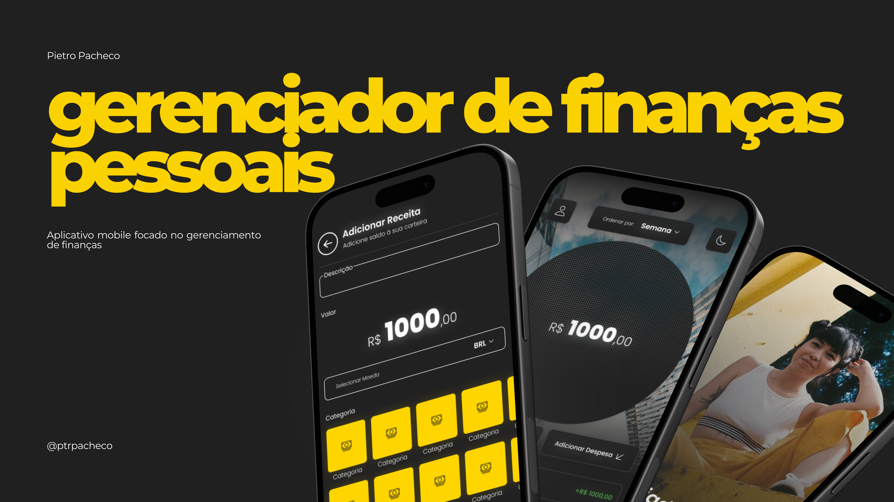

<h1 align='center'>Gerenciador de Finanças Pessoais</h1>

Projeto realizado entre 2025 e 2026

  <a href='#-sobre'>Sobre</a>
  &nbsp&nbsp•&nbsp&nbsp
  <a href='#-desenvolvimento'>Desenvolvimento</a>
  &nbsp&nbsp•&nbsp&nbsp
  <a href='#-tecnologias'>Tecnologias</a>
  &nbsp&nbsp•&nbsp&nbsp
  <a href='#-licencas'>Licença</a>
  &nbsp&nbsp•&nbsp&nbsp
  <a href='https://www.figma.com/community/file/1422676439178901872/caffucinho'>Protótipo</a>

    

    

<h2>💁‍♂️ Sobre o Projeto</h2>
O projeto trata-se de um aplicativo mobile destinado ao gerenciamento e controle de finanças pessoais.

<h2> 📅 Desenvolvimento</h2>
O projeto foi projetado e desenvolvido entre o final de 2025 e início de 2026, projetado no Figma e desenvolvido em MERN Stack (MongoDB, Express, React, Node.js), utilizando workflows no Front-End, como o Tailwind CSS, através do Nativewind, e o Expo-Router.  
O aplicativo aborda diferentes abordagens e tecnologias nunca antes vistas por mim, desde um dot-pattern até animações mais avançadas utilizando o React Native Reanimated.  
<ul>
    <li>Front-end: [GitHub](https://github.com/ptrpacheco/finance-manager).</li>
    <li>Protótipo: [Figma](https://www.figma.com/community/file/1590871304833978693/gerenciador-de-financas-pessoais).</li>
</ul>

<h2> 🤖 Tecnologias</h2>
Esse projeto foi realizado com as seguintes tecnologias:
<ul>
    <li>MongoDB</li>
    <li>Express</li>
    <li>Node.js</li>
    <li>JSON Web Token</li>
    <li>bcrypt.js</li>
</ul>

<h2> 🔑 Licença</h2>
Este projeto está sob a licença MIT.

___

Desenvolvido por Pietro Pacheco 👤
